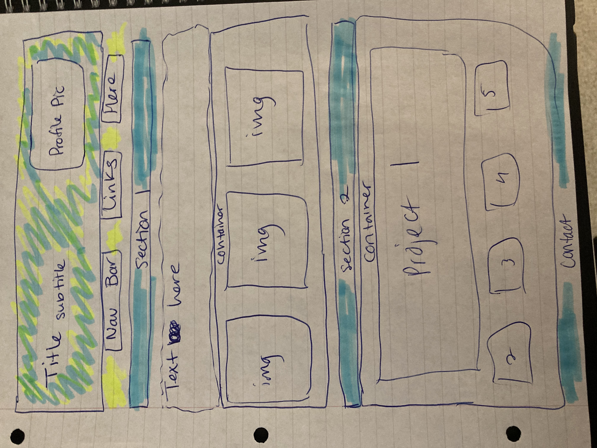

# Homework02

## Web Development Portfolio - Sandy Marr

Welcome to my portfolio for projects in web development and coding. In creating this page, I started out with a sketch to determine the overall layout and funtionality of the page. 

From there, I developed a skeleton structure in html in order to start working on the page layout with css. 

Once the baseline for html and css was in place, I was able to work through an iterative process until the page looked and reacted as intended. This included simple updates in the css and html files before saving and refreshing the page, as well as the use of chrome dev tools to see any impacts live before implementing them. 

There are areas where I plan to make improvements as new skills are learned, but for now, I am excited that I was able to build a page from scratch. 

Dive in! https://sandra-marr.github.io/002_Portfolio

## MIT License

Permission is hereby granted, free of charge, to any person obtaining a copy
of this software and associated documentation files (the "Software"), to deal
in the Software without restriction, including without limitation the rights
to use, copy, modify, merge, publish, distribute, sublicense, and/or sell
copies of the Software, and to permit persons to whom the Software is
furnished to do so, subject to the following conditions:

The above copyright notice and this permission notice shall be included in all
copies or substantial portions of the Software.

THE SOFTWARE IS PROVIDED "AS IS", WITHOUT WARRANTY OF ANY KIND, EXPRESS OR
IMPLIED, INCLUDING BUT NOT LIMITED TO THE WARRANTIES OF MERCHANTABILITY,
FITNESS FOR A PARTICULAR PURPOSE AND NONINFRINGEMENT. IN NO EVENT SHALL THE
AUTHORS OR COPYRIGHT HOLDERS BE LIABLE FOR ANY CLAIM, DAMAGES OR OTHER
LIABILITY, WHETHER IN AN ACTION OF CONTRACT, TORT OR OTHERWISE, ARISING FROM,
OUT OF OR IN CONNECTION WITH THE SOFTWARE OR THE USE OR OTHER DEALINGS IN THE
SOFTWARE.

&copy;2021 Sandra Marr
